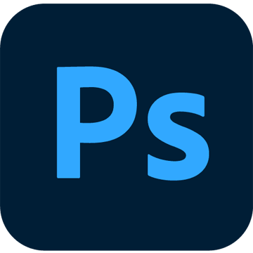
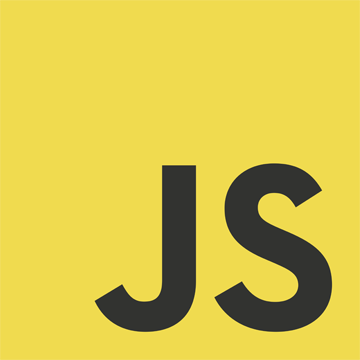

## Hey there o/

my name is **Lyusya**

📫 how to reach me: lyusya.cool@gmail.com 
... or you can find me on [RSSchool](https://rs.school/courses/angular) discord under the name Cherry

## Tech Stack

          

### What's going on

currently one of the coordinators and moderators of RSSchool Angular Course https://rs.school/courses/angular
you can register for the course and try it by yourself https://app.rs.school/registry/student

looking for job as Angular frontend developer (18 version)