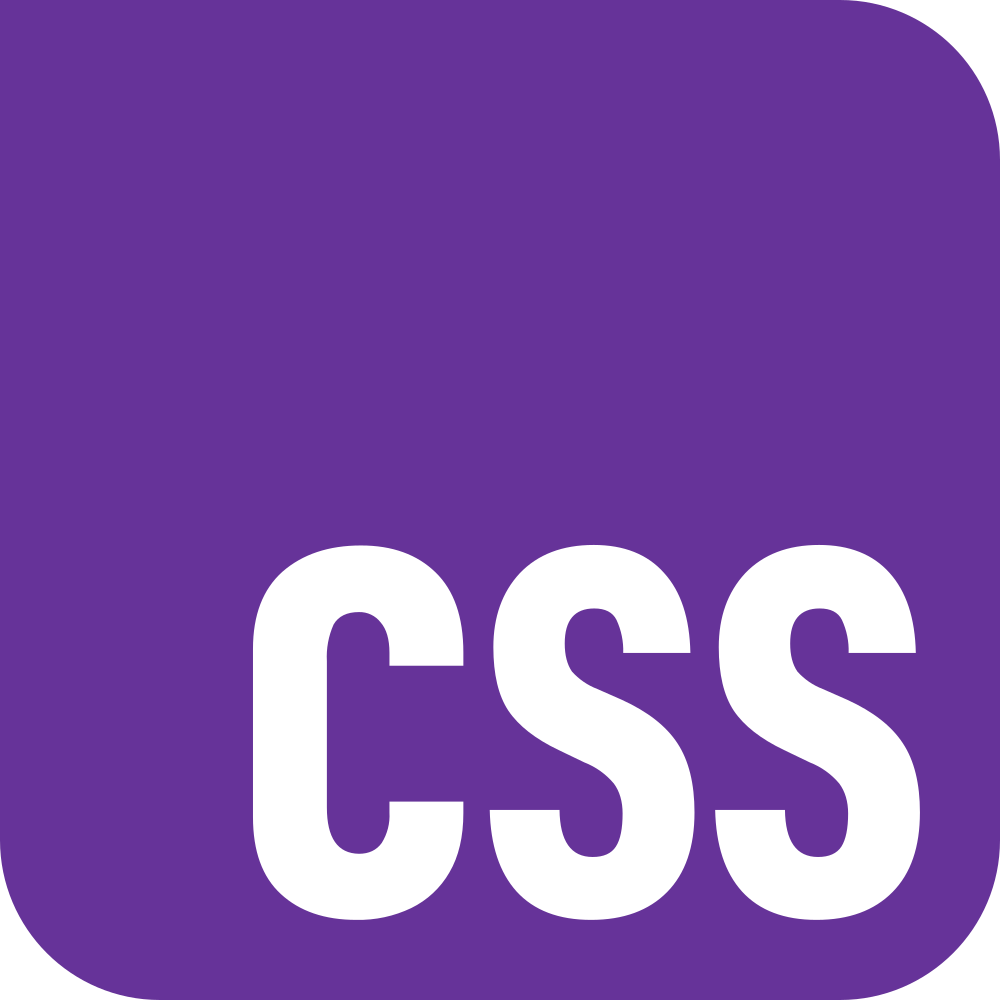
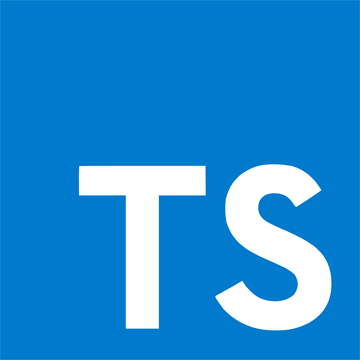
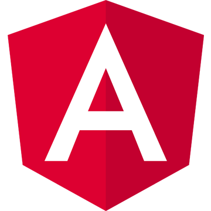
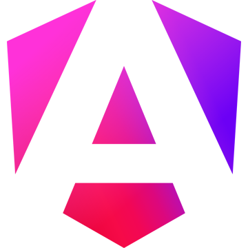

## Hey there o/

my name is Lyusya

- 📫 how to reach me: lyusya.cool@gmail.com 
... or you can find me on RSSchool discord under the name Cherry https://discord.gg/KYZ2eVFy

## Tech Stack

        

<!--
**lyutails/lyutails** is a ✨ _special_ ✨ repository because its `README.md` (this file) appears on your GitHub profile.

Here are some ideas to get you started:

- 🔭 I’m currently working on ...
- 🌱 I’m currently learning ...
- 👯 I’m looking to collaborate on ...
- 🤔 I’m looking for help with ...
- 💬 Ask me about ...
- 📫 How to reach me: lyusya.cool@gmail.com
- 😄 Pronouns: ...
- ⚡ Fun fact: ...
-->
