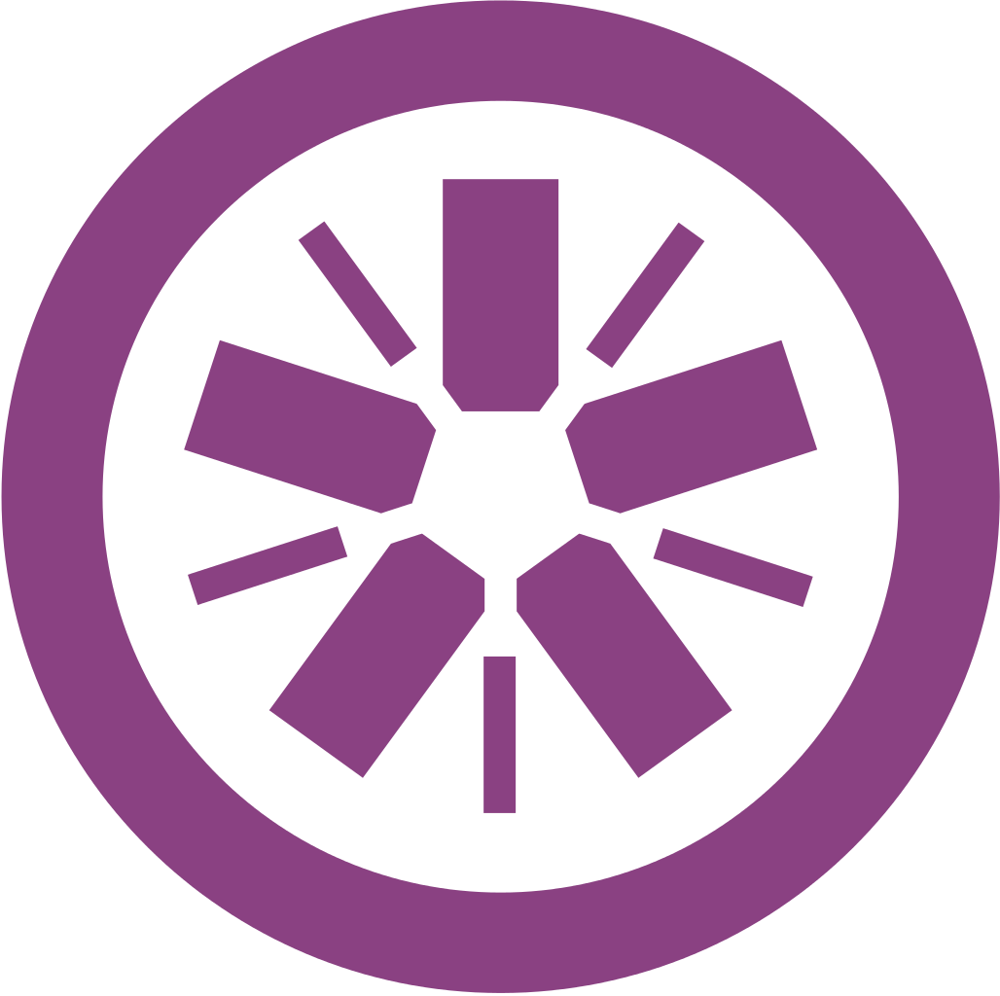
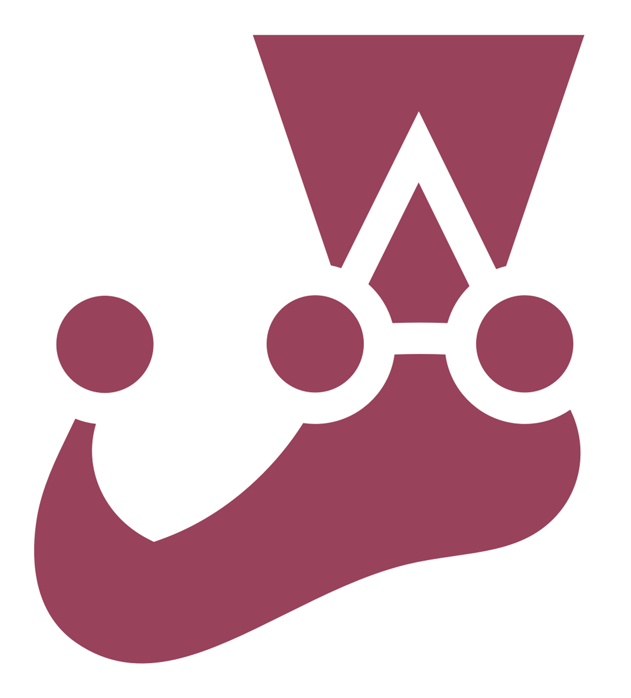

## Hey there o/

my name is **Lyusya**

📫 how to reach me: lyusya.cool@gmail.com 
... or you can find me on [RSSchool](https://rs.school/courses/angular) discord under the name Cherry (@lyutolis)

## Tech Stack

                

### What's going on

activist, one of the coordinators and moderators of [RSSchool](https://rs.school/courses/angular) Angular Course

